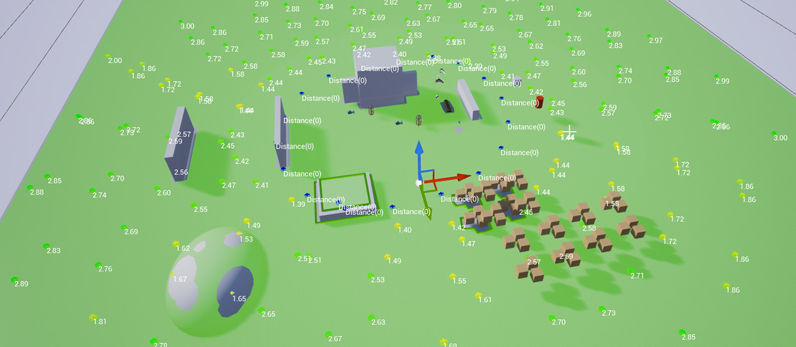

# KaiMart - The Action Game

This project is part of the **my hobby collections** where I build this project step-by-step for fun.

**Current Engine Version: 4.27**

## Highlights/Editors

## Project Features

- Third-person Action Character Movement
- **Action System** (similar to Gameplay Ability System in design)
  - Dash Ability (Teleporting via projectile)
  - Blackhole Ability
  - Magic Projectile Attack
  - "Thorns" buff (reflecting damage)
  - Burning Damage-over-time effect
- AttributeComponent (Holding health etc.)
- **SaveGame System** for persisting progress of character and world state.
- Heavy use of Events to drive UI and gameplay reactions.
- Mix of C++ & Blueprint and how to combine these effectively.
- **GameplayTags** to mark-up Actors, Buffs, Actions.
- **Multiplayer support** for all features
- GameMode Logic
  - EQS for binding bot/powerup spawn locations.
  - Bot spawning system (bots cost points to spawn, gamemode gains points over time to spend)
  - DataTable holds bot information
  - DataAssets to hold enemy configurations
- **Asset Manager:** Async loading of data assets
- Async loading of UI icons
- AI
  - Minion AI with Behavior Trees (Roam, See, Chase, Attack, Flee/Heal)
  - C++ Custom Behavior Trees Nodes
  - EQS for attack/cover locations by AI
    Powerups
- Powerup pickups to heal, gain credits/actions.
  UMG
- Main menu to host/join game
- UI elements for player attributes and projected widgets for powerups and enemy health.
- C++ Localized Text

**Game Assets:** Licensed for use with the Unreal Engine 4 only. Without a custom license you cannot use to create sequels, remasters, or otherwise emulate the original game or use the original game’s trademarks, character names, or other IP to advertise or name your game. (Unreal Engine EULA applies) (Please note this applies to the Game Assets that refer to Epic's Paragon, you can still use the project code and content to build your own Unreal Engine game).